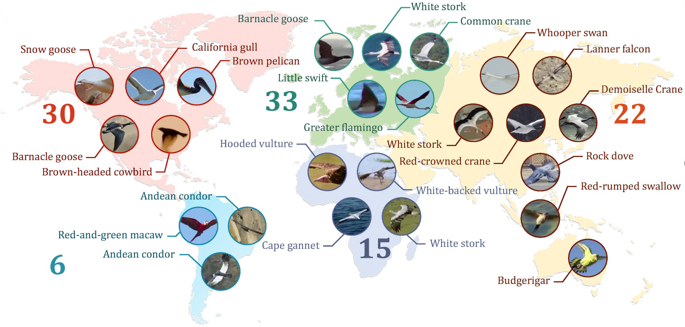

# 🏃‍♀️NetTrack 

[[`Project`](https://george-zhuang.github.io/nettrack/)] [[`Paper`]()] [[`Demo`](https://www.youtube.com/watch?v=h81R1B8HuOE)] [[`Dataset (Google)`](https://drive.google.com/drive/folders/140mPnOVZY-2apH76at9yYuVGIDWOvsH_?usp=sharing)] [[`Dataset (Baidu)`](https://pan.baidu.com/s/1Ztu8-JJLFHmMkJyWrJQ8lQ?pwd=bft5)] [[`Dataset (Ali)`](https://www.alipan.com/s/NFkpgDDw6R3)]

[Guangze Zheng¹](https://george-zhuang.github.io/), [Shijie Lin¹](https://scholar.google.com/citations?user=sQINQ-YAAAAJ&hl=zh-CN&oi=ao), [Haobo Zuo¹](https://scholar.google.com/citations?user=5RhJGKgAAAAJ&hl=zh-CN&oi=ao), [Changhong Fu²](https://scholar.google.com/citations?user=zmbMZ4kAAAAJ&hl=zh-CN&oi=ao), [Jia Pan¹*](https://scholar.google.com/citations?user=YYT8-7kAAAAJ&hl=zh-CN&oi=ao)

[HKU¹](https://www.hku.hk/), [Tongji University²](https://www.tongji.edu.cn/)

PyTorch implementation for NetTrack.

## 📣 News
- [2024/03/16] 💻 Code has been released.
- [2024/03/01] 📰 NetTrack has been accepted by **CVPR 2024**.

## :hammer_and_wrench: Install 

- **Prerequisite**
  ```bash
  conda create -n nettrack python=3.10 # please use the default version
  pip3 install torch torchvision # --index-url https://download.pytorch.org/whl/cu121
  pip3 install -r requirements.txt
  pip3 install cython; pip3 install 'git+https://github.com/cocodataset/cocoapi.git#subdirectory=PythonAPI'
  pip3 install cython_bbox
  sudo apt update
  sudo apt install ffmpeg
  ```

  Install Grounding DINO and CoTracker:
  ```bash
  pip install git+https://github.com/IDEA-Research/GroundingDINO.git
  pip install git+https://github.com/facebookresearch/co-tracker.git
  ```

- **Prepare weights:**
  Download the default pretrained Grouding DINO and CoTracker model:
  ```bash
  cd weights
  cd groundingdino
  wget https://huggingface.co/ShilongLiu/GroundingDINO/resolve/main/groundingdino_swinb_cogcoor.pth
  cd ..
  mkdir cotracker && cd cotracker
  wget https://dl.fbaipublicfiles.com/cotracker/cotracker_stride_4_wind_8.pth
  cd ..
  ```

## :bird: BFT dataset


- 📊 Bird flock tracking (**BFT**) dataset:
  - 🎬106 various bird flight videos with 22 species and 14 scenes 
  - 🎯collected for artifical intelligence and ecological research
  - 📈 We provide a Multiple Object Tracking (**MOT**) benchmark for evaluating open-world MOT for highly dynamic object tracking.
  
- 📥 Download **BFT dataset v1.5**
  - **[Recommended]** Download with [Google Drive](https://drive.google.com/drive/folders/140mPnOVZY-2apH76at9yYuVGIDWOvsH_?usp=sharing)
  - Download with [Baidu Pan](https://pan.baidu.com/s/1Ztu8-JJLFHmMkJyWrJQ8lQ?pwd=bft5)
  - Download with [AliPan](https://www.alipan.com/s/NFkpgDDw6R3)
      ```Due to policy limitations of Alipan, please run the .exe file directly to decompress data.```


## 🚀 Get started
- Run default demo video. 
  ```bash
  sh tools/demo/demo_seq.sh
  ```
  The results will be shown in ```./data/demo/track_res```.

# Using NetTrack for clothes tracking

## :hammer: Demo
**Run on the demo video**
To test the demo, simply run:
```bash
sh tools/cloth_demo/demo_seq_prompt_change.sh
```
The results are saved in ```./output/track_res/cloth_demo.mp4```.

**Run on new videos**
Add the videos into ```./data/cloth/demo/videos```.
The script ```demo_seq_prompt_change.sh``` contains 4 steps:
- Transform the videos to images sequences
- Get detection results
- Track on the video
- Transform the tracking results into videos

Please comment out any unnecessary steps.

**Prompt change**
Now the code support changing prompt once. Just specify the second prompt in the 2nd step (detection):
```python
python tools/cloth_demo/det_demo.py \
    --data_dir ./data/cloth/demo/images \
    --seq ${video_name} \
    --camera '' \
    --text_prompt "clothes in hand" \
    --prompt_mode multi \
    --second_prompt "black clothes" \ 
    --second_prompt_frame 200 # prompt change frame
```
In this example, the second prompt is ```"black clothes"```, and the prompt is changed at frame ```200```.

## :star: Tricks
Tune the ```--track_thres``` in the 3rd step (tracking). 
Lower value encourages discovering more potential objects but may introduce :warning:**unwanted** objects.

## 🎞️ Video
<div class="text-left">
    <iframe width="600" height="330" src="https://www.youtube.com/embed/h81R1B8HuOE?si=6bgoNCkJUEIUjTJY"
        title="YouTube video player" frameborder="0"
        allow="accelerometer; autoplay; clipboard-write; encrypted-media; gyroscope; picture-in-picture; web-share"
        allowfullscreen></iframe>
</div>

## 😮 Cite our work
If you find this dataset useful, please cite our work. Looking forward to your suggestions to make this dataset better!
```
@Inproceedings{nettrack,
title={{NetTrack: Tracking Highly Dynamic Objects with a Net}},
author={Zheng, Guangze and Lin, Shijie and Zuo, Haobo and Fu, Changhong and Pan, Jia},
booktitle={Proceedings of the IEEE/CVF Conference on Computer Vision and Pattern Recognition (CVPR)},
year={2024},
pages={1-8}}
```